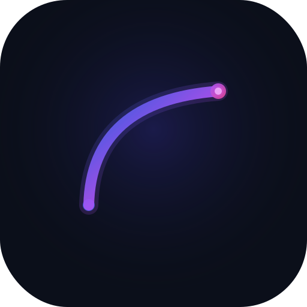
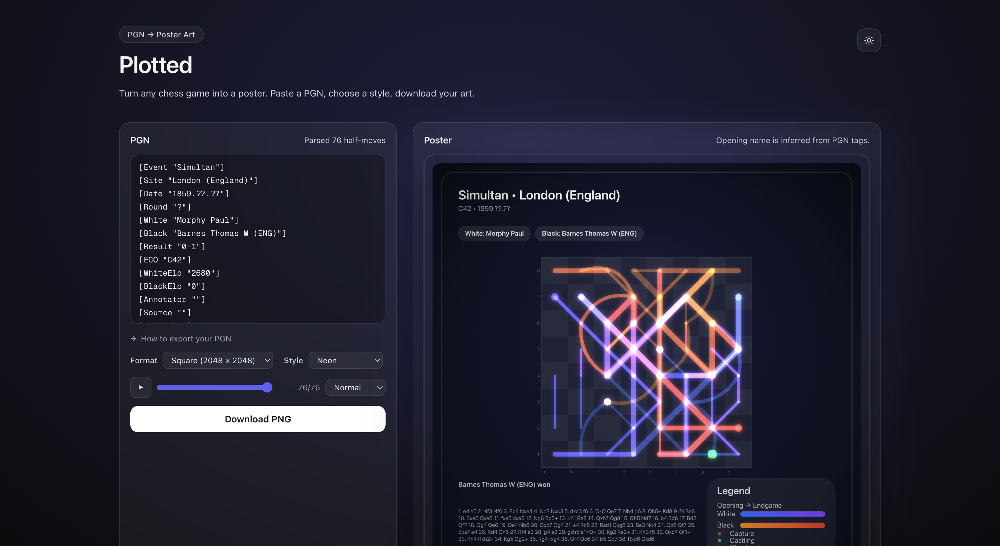
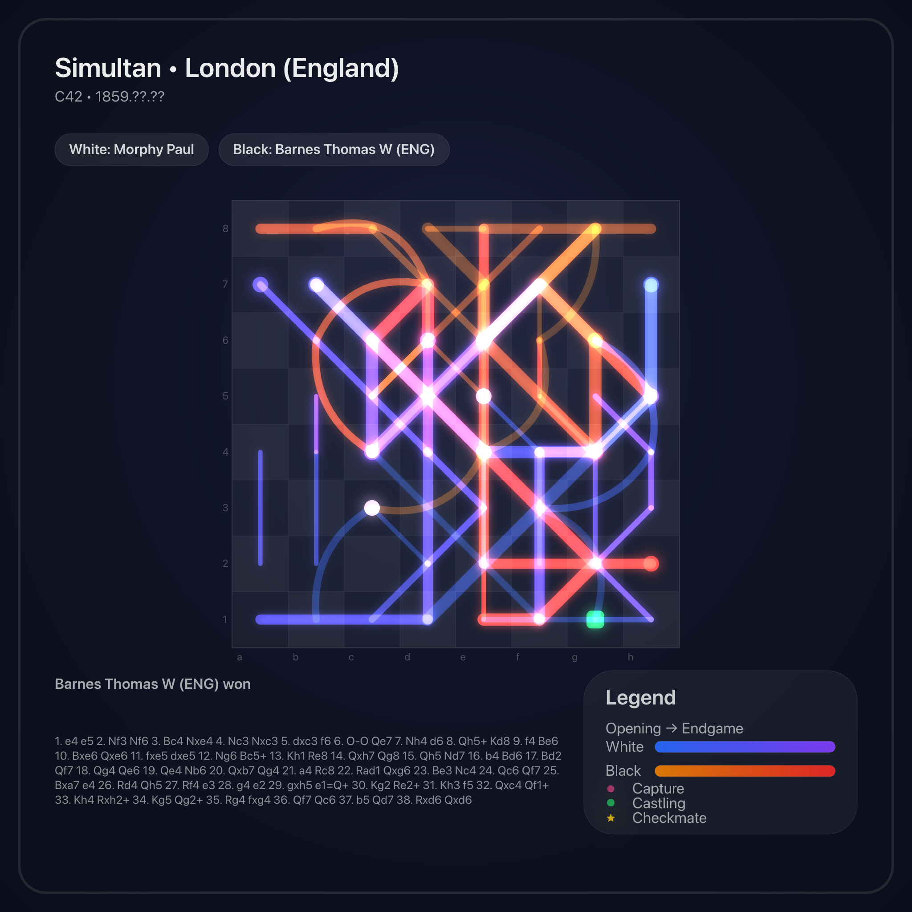
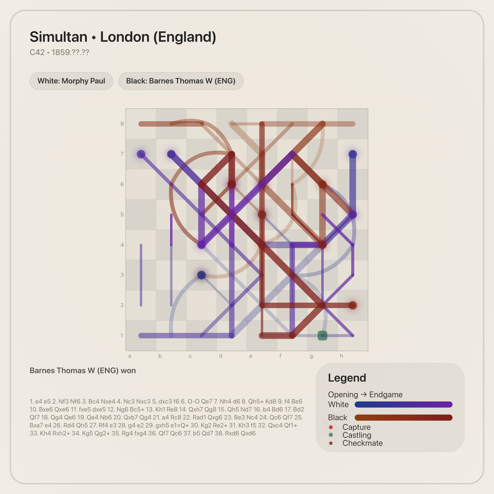
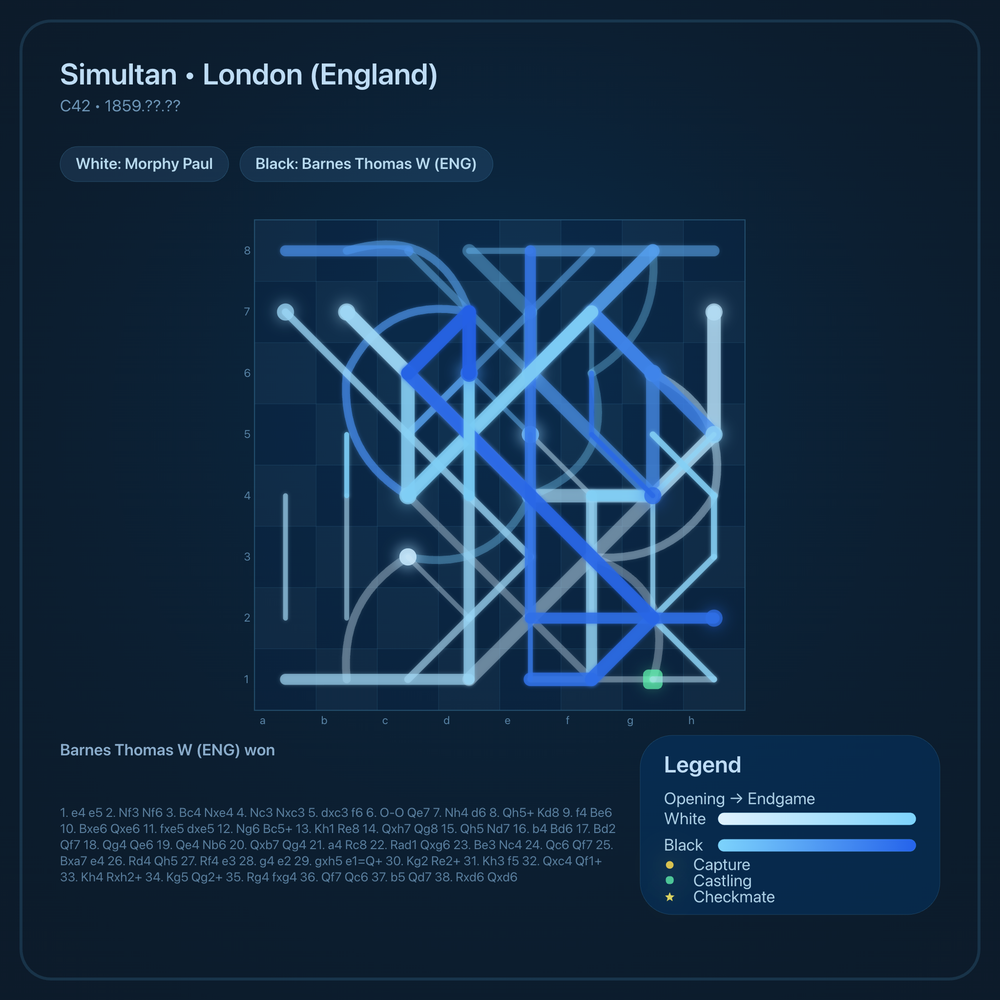
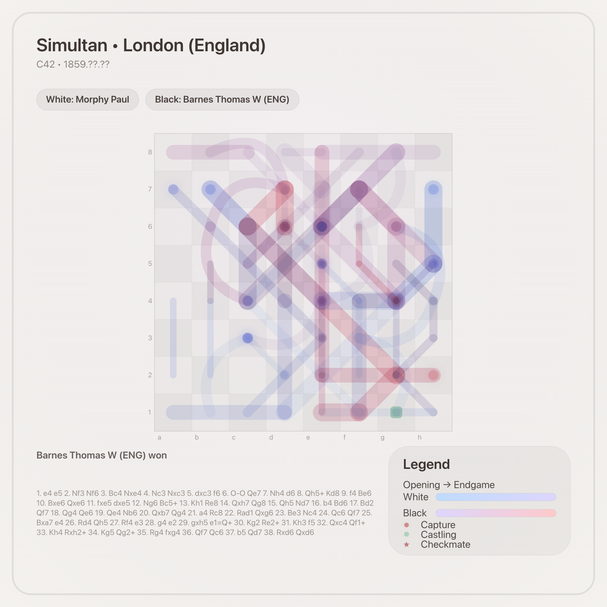
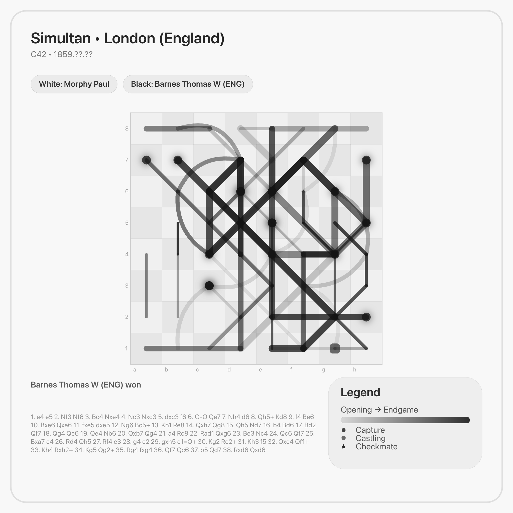
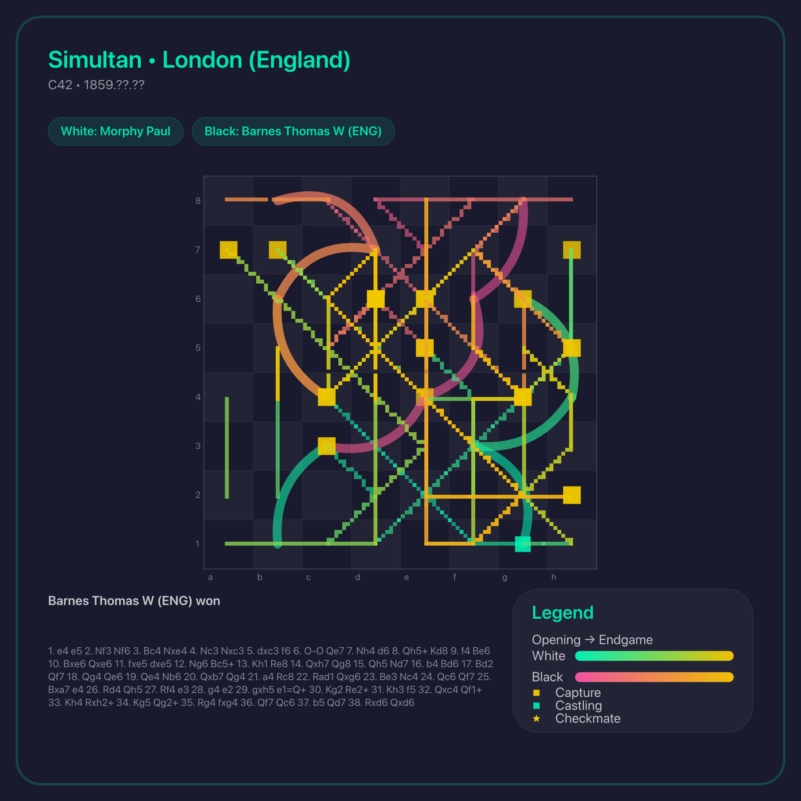
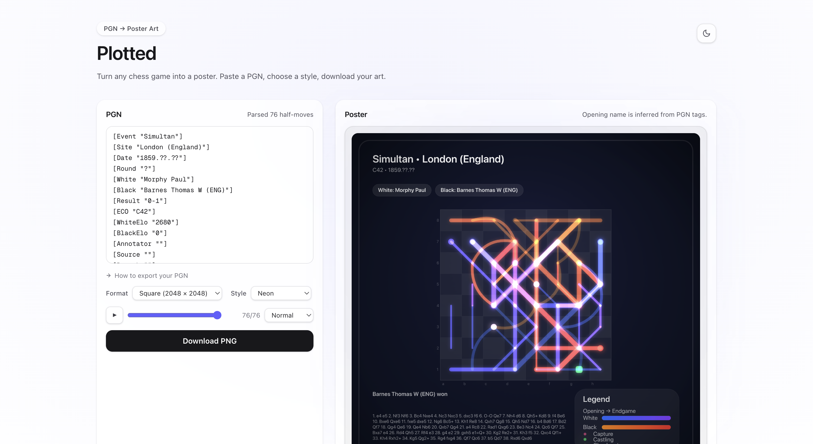

#  Plotted

Turn any chess game into a poster. Paste a PGN, pick a style, download your art.



[Try it live](https://plottedart.com/)

---

## Examples

| Neon                                                        | Ink on Paper                                              |
| ----------------------------------------------------------- | --------------------------------------------------------- |
|  |  |

| Blueprint                                                             | Watercolour                                                               |
| --------------------------------------------------------------------- | ------------------------------------------------------------------------- |
|  |  |

| Monochrome                                                              | Retro                                                         |
| ----------------------------------------------------------------------- | ------------------------------------------------------------- |
|  |  |

---

## Drawing Animation Preview


## Themes

| Dark mode                             | Light mode                                    |
| ------------------------------------- | --------------------------------------------- |
|  |  |

## Features

- **6 visual styles** — Neon, Ink on Paper, Blueprint, Watercolour, Monochrome, Retro
- **Light & dark themes** — switch between clean minimal light mode and immersive dark mode
- **Animated playback** — progressive line drawing with full timeline control:

  - Play / Pause
  - Scrub through moves like a video
  - 4 playback speeds: _Slow, Normal, Fast, Very Fast_

- **3 export formats** — Square (2048×2048), Portrait (A4 print), Landscape (wallpaper)
- **Move visualisation** — line weight and colour encode piece type and game phase
- **Special markers** — captures, castling, and checkmate highlighted distinctly
- **High-res PNG export** — render at full resolution, download instantly

- **Poster mode** includes:
  - Player names
  - Opening
  - Result
  - Full move notation

---

## How to use

1. **Paste a PGN** — export from Chess.com or Lichess and paste it into the input panel
2. **Choose a style and format** — experiment with visual themes and output shapes
3. **Play the game** — watch moves unfold as an animation
4. **Download** — click _Download PNG_ to save the full-resolution artwork

---

## Run locally

```bash
npm install
npm run dev
```

Open [http://localhost:3000](http://localhost:3000).

---

## Tech stack

|             |                         |
| ----------- | ----------------------- |
| Framework   | Next.js 15 (App Router) |
| Language    | TypeScript              |
| Styling     | Tailwind CSS            |
| Chess logic | chess.js                |
| Rendering   | HTML Canvas API         |

---

## License

MIT
